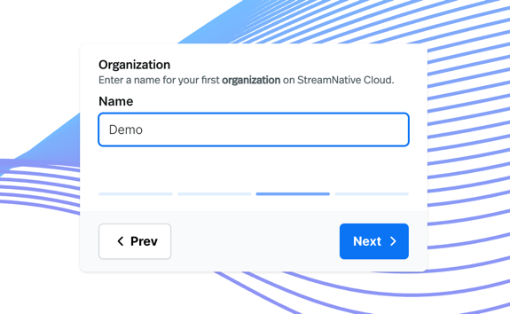
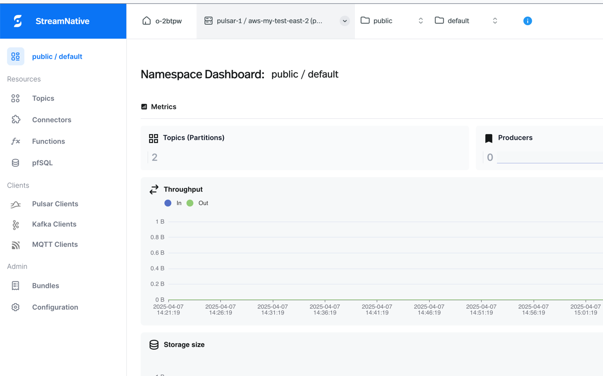
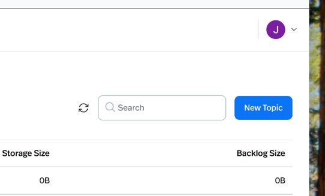
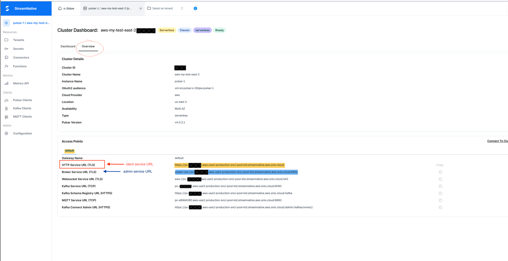

# Deploying a Pulsar Cluster with StreamNative and Using Numaflow to Produce and Consume Messages

## Introduction

This document demonstrates how to:  
1. Deploy a Pulsar cluster using StreamNative  
2. Connect the remote Pulsar cluster to a local Numaflow pipeline, and produce and consume messages  

### StreamNative

StreamNative Cloud is a data streaming service, delivered as a fully managed Pulsar and Kafka service. It removes the complexity of managing Pulsar and Kafka. StreamNative provides two options—StreamNative Hosted or BYOC Cloud—to run Pulsar or Kafka in the cloud in a simple, fast, reliable, and cost-effective way.

• Fully Hosted: StreamNative clusters hosted on StreamNative's public cloud account, available on AWS, GCP, and Azure. You can choose between Serverless and Dedicated clusters.  
• Bring Your Own Cloud (BYOC): Host on your own public cloud account (AWS, GCP, or Azure), managed by StreamNative.

[More info here](https://docs.streamnative.io/docs/cloud-overview)

### Prerequisite

Ensure you have Numaflow installed. If not, see the Quick Start guide at https://numaflow.numaproj.io/quick-start/.

### Getting Started with StreamNative

This guide focuses on using the StreamNative Cloud Console for management and interactions.

1. Go to https://streamnative.io/  
2. Create an account at the StreamNative Console: http://console.streamnative.cloud/  
3. Follow the guided prompts to create an organization  
     
4. Follow steps 2–4 in this document: https://docs.streamnative.io/docs/quickstart-console  

   **In step 3, SAVE THE API KEY.**  
5. Select an instance, tenant, and namespace in the top-left bar. This will allow you to select "Topics" from the left side of the page:  
     
6. To test producing messages, we will test the UDSink. Go to [docs/sink/byte-array/manifests/jwt-token](https://github.com/numaproj-contrib/apache-pulsar-java/blob/master/docs/sink/byte-array/manifests/jwt-token), copy these template files, and provide the service URL and topic name.  
7. Click "New Topic" and add a name and desired number of partitions. Remember your topic name, and add it in the ConfigMap under the producer. It should follow the format `persistent://tenant/namespace/topic`.  
     
8. To get the service URL, select an instance, then click on the "Overview" tab. For this step, you only need the client service URL (in red).  
     
   You should see a page like this. Copy the HTTP service URL and paste it as the client service URL.  
     
9. Paste the API key as a string for the value corresponding to the key `authParams`. You can then apply the ConfigMap and the pipeline for the UDSink. This pipeline generates one message every 10 seconds, and the UDSink **produces** the messages to the topic.

   **To apply the ConfigMap:**
   ```
   kubectl apply -f "byte-arr-producer-config.yaml"
   ```
   **To apply the pipeline file:**
   ```
   kubectl apply -f "byte-arr-producer-pipeline.yaml"
   ```
   You should see changes to throughput and storage size in the StreamNative cluster dashboard.

10. To see the messages produced, you can use the CLI or apply another pipeline for testing. Provide values for the required fields in the UDSource ConfigMap, which can be found at [docs/sink/byte-array/manifests/jwt-token](https://github.com/numaproj-contrib/apache-pulsar-java/tree/master/docs/sink/byte-array/manifests/jwt-token).  
    Refer to step 8 to get the URL for the admin, the topic name, and the API key. Use the same topic name and API key. Apply the pipeline to **consume** messages from the specified topic and log them. On checking the pod logs, you should see the same messages generated by the first pipeline.
